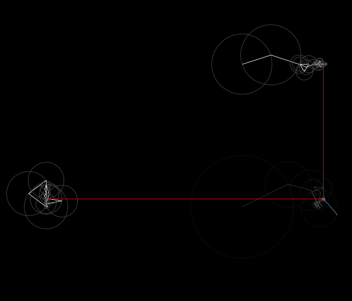

# DiscreteFourierTransform

Implements a Discrete Fourier Transform over an arbitrary set of (x,y) points.

# LineFlow
Several experiments working with flow fields and other generated artwork

https://github.com/MyNameIsCalvinDavis/Processing/assets/20341905/7f8c69f9-6c9b-42ba-90c2-16f394070d03

