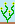
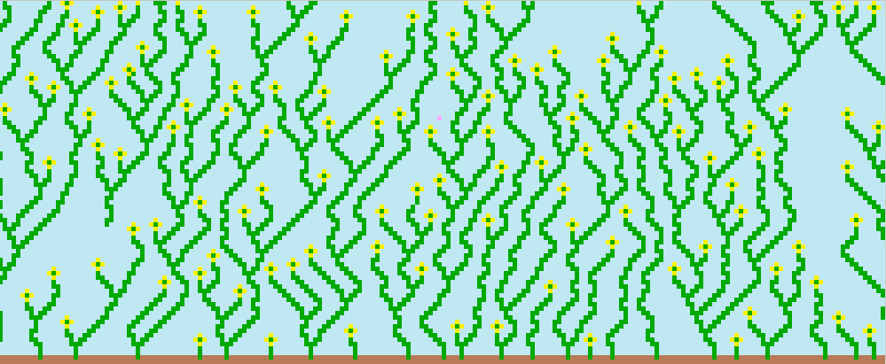
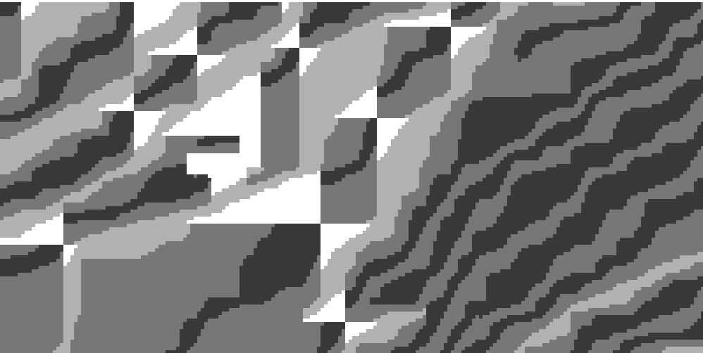
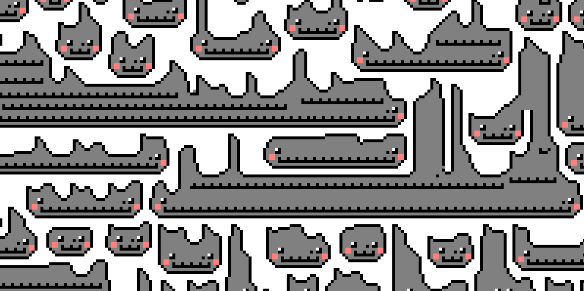
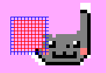

# Wave Function Collapse
### Simple Tiled Model / ESTM
First pass at adjacency-rule WFC. It does the job, at present adjacency rules don't take into consideration rotation or reflection data because the domain reduction was my main goal. Ex: If a cell has data ABC, and another cell has data ABC, they both hash to the same identity despite being two separate objects.

My take at automatically generated adjacency rules was convoluted and not as interesting as the Overlapping WFC algorithm. I didn't generate a set of all tiles and THEN calculate adjacency (based on the edge colors of a tile), I just took the adjacent tiles within the image and made rules for neighbors. It was easier. It also meant that the domains of each cell were more restricted and it ran into superposition issues a lot more frequently.

Derived from the following resources:  
https://robertheaton.com/2018/12/17/wavefunction-collapse-algorithm/  
https://www.boristhebrave.com/2020/04/13/wave-function-collapse-explained/  
https://paulmerrell.org/model-synthesis/

### Overlapping WFC

| SRC  | Output |
| ------------- | ------------- |
|   |   |
|   |   |
|   |   |

It mostly works... you can see some errors here and there but honestly I can't be bothered to figure out why. For example - in the flower output, you can see a flower stem on the left side of the picture that hangs in the air. I expect this is due to how I'm processing the recursive collapse function - It's likely that two collapsing waves hit each other and ended in the middle, producing a stem from the top and "air" from the bottom.

| 

Most of these kinds of errors fix themselves. This project also implements a radial reset (opposed to either back-jumping, which is also an implemented option, or back propagation) where the red cells are reset back to a full unobserved state, and the blue cells are recursively re-calculated.

This solution isn't perfect and I believe back jumping works better, but this takes less time and produces mostly decent results. Back-jumping can run into an issue where two waves meet in the middle that have existed for a long time that are not compatible, and so the wave just jumps back over and over again forever. There are solutions to this, but I found the radial reset easier.

https://www.gridbugs.org/wave-function-collapse/  
https://www.youtube.com/watch?v=5iSAvzU2WYY  