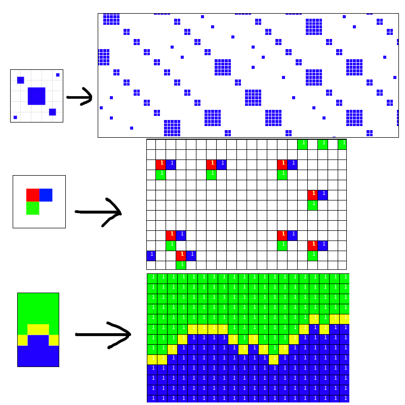

# Wave Function Collapse
### Simple Tiled Model / ESTM
First pass at adjacency-rule WFC. It does the job, at present adjacency rules don't take into consideration rotation or reflection data because the domain reduction was my main goal. Ex: If a cell has data ABC, and another cell has data ABC, they both hash to the same identity despite being two separate objects.

My take at automatically generated adjacency rules was convoluted and not as interesting as the Overlapping WFC algorithm. I didn't generate a set of all tiles and THEN calculate adjacency (based on the edge colors of a tile), I just took the adjacent tiles within the image and made rules for neighbors. It was easier. It also meant that the domains of each cell were more restricted and it ran into superposition issues a lot more frequently.

Derived from the following resources:  
https://robertheaton.com/2018/12/17/wavefunction-collapse-algorithm/  
https://www.boristhebrave.com/2020/04/13/wave-function-collapse-explained/  
https://paulmerrell.org/model-synthesis/

### Overlapping WFC
https://www.gridbugs.org/wave-function-collapse/  
https://www.youtube.com/watch?v=5iSAvzU2WYY  
